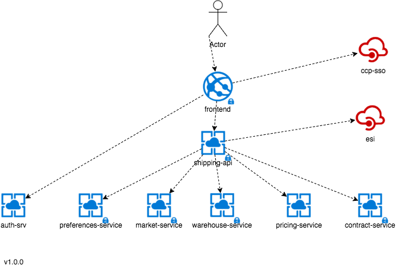
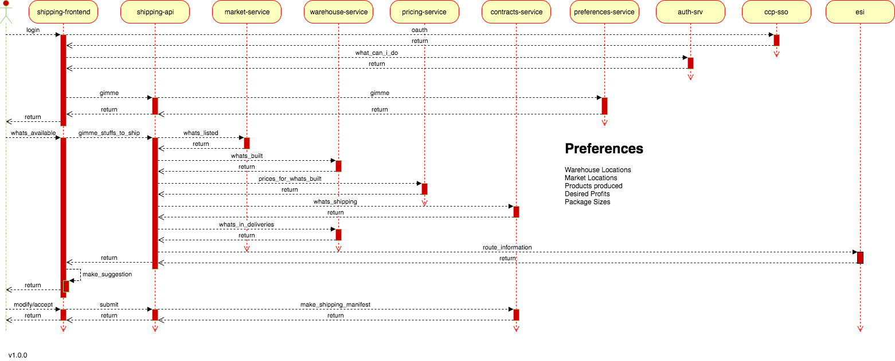

# Shipping Documentation

_(IN PROGRESS)_

The act of shipping has many different components involved.

1. Things being purchased with the intent of combining into a final product
    1.
2. Final products being moved to the market for sale
    1. Data providers
        1. market-service (what's listed))
        2. contract-service (what's currently enroute)
        3. warehouse-service (how much do you have invested in the final products)
        4. pricing-service (what is the expected estimated sales price of the products)
3. Previously purchased inputs moving from one production location to another

The pieces

The general flow

